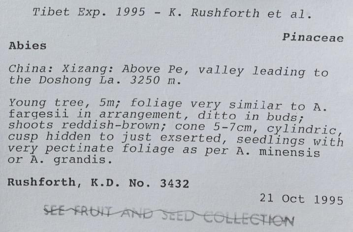
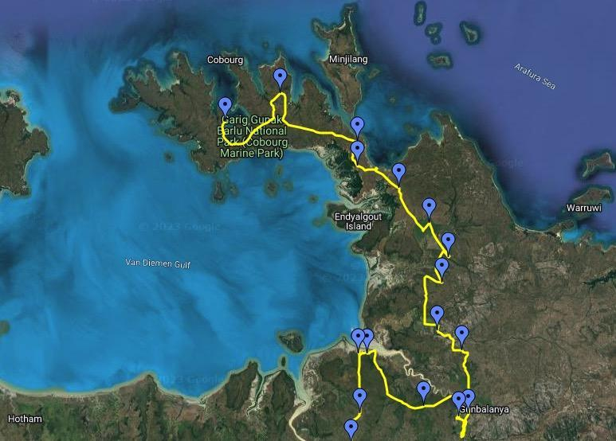

# Georeferencing Checklist
{: .no_toc }

  {: .no_toc .text-delta }

  

    Table of contents
  

  {: .text-delta }
- TOC
{:toc}

# Georeferencing
## What is Georeferencing?
Georeferencing is the process of describing a place on Earth with geospatial geometries. A georeference allows us to show where something happened, such as where a specimen was collected, on a map. By enabling an event geospatially in this way, it ultimately enables any other geospatially-enabled data, such as environment, to be linked. 

As an example, the specimen label above from the Royal Botanical Garden Edinburgh, states that the specimen was collected in *“China: Xizang: Above Pe, valley leading to the Doshong La. 3250 m.”*. An interpretation of this location description as a polygon would be a georeference for this specimen.

## Why is it important?
The location where a specimen was collected is a fundamental piece of data for its study. The location provides the environmental context where that specimen lived and the community of organisms with which it coexisted; potentially providing a way to study its traits in light of adaptation to its habitat. This in turn enables us to conduct eco-evolutionary research, support conservation efforts, and adapt to global change. Moreover, georeferenced specimens allow institutions to showcase the geographical extent of their collections, detect over- and under-sampled territories, reconstruct the history of collections and draw the itineraries followed by collectors, among many other educational and scientific purposes.

As an example of the reconstruction of historical expeditions, the map below shows part of the expedition around Van Diemen Gulf in northern Australia, corresponding to the expedition by Freidrich Wilhelm Ludwig Leichhardt from Moreton Bay to Port Essington between 1844 and 1845.

Credit: National Centre of Biography, Australian National University.

## Guidelines and best practices
For a comprehensive overview of georeferencing we recommend carefully reading [Georeferencing Best Practices](https://docs.gbif.org/georeferencing-best-practices/1.0/en) by Chapman and Wieczorek (2020). If you are not familiar with basic georeferencing and cartographic concepts, we strongly suggest paying special attention to sections [1. Introduction](https://docs.gbif.org/georeferencing-best-practices/1.0/en/#introduction) and [2. Elements for describing a location](https://docs.gbif.org/georeferencing-best-practices/1.0/en/#elements-for-describing-a-location). For practical application of georeferencing methods we recommend the [Georeferencing Quick Reference Guide](https://doi.org/10.35035/e09p-h128) by Zermoglio et al. (2020).

## Current practice and georeferencing quality
Based on a global survey conducted from December 2019 to April 2020 [(Marcer et al., 2021)](https://doi.org/10.5281/zenodo.4644529) and responded to by Natural History Collections representing over 700 institutions from over 80 countries, digitisation is going on in around 80% of the institutions, with around 30% of these having reached 100% of their digitisation objectives. Georeferencing lags behind the digitisation process, and only about 12% of collections have georeferences for over 90% of their records. Specimens with textual descriptions of where they were collected predominate over those with coordinates. The interpretation of the descriptive text of a location to assign coordinates and uncertainty is a laborious and slow process, which is surely one of the reasons why georeferencing is being done at a slow pace relative to digitisation. The survey also found a low commitment to the use of existing protocols and guidelines; 44% of collections reported not using any. Moreover, the great majority of respondents, 84%, just use Google Maps or Google Earth as a tool, and only a minority use dedicated tools such as [GEOLocate](https://www.geo-locate.org). With respect to the management of georeferenced site names, respondents used a wide range of tools and, more significantly, a third of them did not use any. Moreover, spatial uncertainty was not considered important by two thirds of the respondents and about half of them did not capture it in their databases. Lastly, only about 44% were said to have been shared via GBIF at the time. 

When georeferencing a specimen, it is important to calculate and record the spatial uncertainty derived from the process. Spatial uncertainty represents an essential piece of information since it informs the final users of the scope of appropriate uses for the geospatial information. It also allows for a rigorous treatment of occurrence data in research, e.g., species distribution and niche modelling. A recent study that took into account all preserved specimen occurrence data mediated by GBIF found that only 38% of records had coordinates and only about 47% of these had their uncertainty reported [(Marcer et al., 2022)](https://doi.org/10.1111/ecog.06025).

## Critical points, pitfalls to avoid and recommendations
As of early 2023, georeferencing does not seem to keep pace with the digitisation of preserved specimens. A workshop held in Warsaw in 2020 identified several major reasons that could explain the paucity and general inadequacy of georeferencing in many  of the existing georeferenced collections, even considering the availability of quality guidelines and tools [(Marcer et al., 2020)](https://doi.org/10.5281/zenodo.3734848). The reasons were the following:

**Insufficient awareness on the importance of georeferencing**. Sufficient consideration must be given to georeferencing as this is the only way by which collected specimens can be referred to their geographical and environmental context, which is compulsory for many inventorial, educational and research uses. Moreover, it is important to have an understanding of the basic cartographical concepts underlying the georeferencing process, a knowledge of the minimal set of information that needs to be captured, and be aware of the guidelines, protocols and tools available.

**Collection Management Systems (CMSs) not fulfilling the needs of georeferencing**. CMSs ought to have the necessary fields and functionalities to record the Darwin Core (DwC) specification for location information (Darwin Core, accessed 2023.01.13, [https://dwc.tdwg.org/terms/#location](https://dwc.tdwg.org/terms/#location)). When considering which CMS to use, several considerations can make a difference in the success of the integration of the georeferencing process within the digitisation process: tool friendliness; ease-of-integration with georeferencing tools either in a direct way or through the use of automated data pipelines; interoperability through the use of DwC import and export capabilities; bulk editing; and the possibility to filter and group records with geographical criteria. In the usual case where a CMS is already in place and has limited georeferencing functionality, the best strategy might be to devise a way to capture the DwC locational data in a complementary tool (spreadsheet, database, etc.). This will enable the future incorporation of all georeferences if the CMS gets upgraded or substituted.

**Not realising that georeferencing requires a lot of effort**. Georeferencing is a labour-intensive and costly process, albeit important. Imaging and databasing usually take precedence. In the absence of adequate workflows or tools, much of the effort put into the process may be lost; e.g., when the target CMS can not accommodate all data and metadata that have been captured. It is thus essential to bear the risks in mind and take action to avoid them. It is important to embrace the use of best practices, even at the expense of slower georeferencing rates. Incomplete, poor-quality georeferenced data may, in the end, misrepresent the reasonable interpretation of the original location description in untraceable ways, leading to inappropriate use of georeferenced data without any easy way to filter or recognize the range of appropriate uses. This can be worse than a waste of effort, it can lead to bad science and bad decisions. If resources are limited, we recommend researching ways to streamline the workflow, including prioritising datasets, and without compromising georeferencing best practices. Some strategies which can help in lessening the workload are citizen science or crowdsourcing projects (although these need to be carefully thought out), georeferencing by distinct locations, pooling resources with other institutions or collections, as many site names may be duplicated across them.

**Too complicated tools**. Taking into consideration friendliness and interoperability when choosing a georeferencing tool is an important point. It can make a big difference in the ease and efficiency with which georeferencing is carried out.

**Inefficient use of geographic features**. From the very start it is advisable to build up an in-house georeferenced gazetteer, i.e., a database of already georeferenced site names, so that georeferencing work for specimens sharing the same collection location is not duplicated. Furthermore, in order to reduce the workload and make results consistent, resources can be pooled with companion institutions both to share georeferenced site names and to distribute work spatially in a way that sites are georeferenced by whomever has better knowledge or resources about the region. When building a gazetteer it is important to take history into consideration as it may determine the geographical boundaries of a site, e.g., an administrative region that has changed over time.

## Software tools
### GEOLocate
GEOLocate, A Platform for Georeferencing Natural History Collections Data, https://www.geo-locate.org
### Georeferencing Calculator
Wieczorek C, Wieczorek J (2021). Georeferencing Calculator. Available: http://georeferencing.org/georefcalculator/gc.html. Accessed [2023-02-15].
### Ali-Bey
Marcer A, Escobar A, Garcia-Font V, Uribe F, Marcer A, Uribe F (2022) Ali-Bey - an open collaborative georeferencing web application. Biodiversity Data Journal;10, http://doi.org/10.3897/bdj.10.e81282. GitHub repositories: https://github.com/aescobarr/mcnb-alibey (main application), https://github.com/aescobarr/mcnb-alibey-api (API), https://github.com/aescobarr/mcnb-alibey-docker (Dockerized version)
### GeoPick
Marcer A, Escobar E, Uribe F, Chapman AD and Wieczorek JR (v.1.0.2023-Beta, in development). GeoPick: an online companion tool for easy georeferencing following best practices[web application] [Web application].

## References and further reading

Bloom TDS, Flower A and DeChaine EG (2018). Why georeferencing matters: Introducing a practical protocol to prepare species occurrence records for spatial analysis. Ecology and Evolution, 8: 765--777. [https://doi.org/10.1002/ece3.3516](https://doi.org/10.1002/ece3.3516)

Chapman, AD, & Wieczorek, JR (2020). Georeferencing Best Practices. GBIF Secretariat. [https://docs.gbif.org/georeferencing-best-practices/1.0/en/](https://docs.gbif.org/georeferencing-best-practices/1.0/en/)

iDigBio Georeferencing website [https://www.idigbio.org/wiki/index.php/Georeferencing](https://www.idigbio.org/wiki/index.php/Georeferencing)

Lohonya K, Livermore L, Penn M. (2020). Georeferencing the Natural History Museum’s Chinese type collection: of plateaus, pagodas and plants. Biodiversity Data Journal, 8: e50503. [https://doi.org/10.3897/BDJ.8.e50503](https://doi.org/10.3897/BDJ.8.e50503)

Marcer A, Chapman AD, Wieczorek JR, Picó FX, Uribe F, Waller J and Ariño A (2022). Uncertainty matters: ascertaining where specimens in natural history collections come from and its implications for predicting species distributions. Ecography. 2022, e06025. [https://doi.org/10.1111/ecog.06025](https://doi.org/10.1111/ddi.13208)
 
Marcer A, Haston E, Groom Q, Ariño AH., Chapman AD, Bakken T, Braun P, Dillen M, Ernst M, Escobar A, Fichtmüller D, Livermore L, Nicolson N, Paragamian K, Paul D, Petterson LB Phillips S, Plummer J, Rainer H, Rey I, Robertson T, Röpert D, Santos J, Uribe F, Waller J and Wieczorek JR (2021). Quality issues in georeferencing: From physical collections to digital data repositories for ecological research. Diversity and Distributions, 27: 564–567. [https://doi.org/10.1111/ddi.13208](https://doi.org/10.1111/ddi.13208)

Marcer A, Groom Q, Haston E, Uribe F. (2021). Natural History Collections Georeferencing Survey Report. Current georeferencing practices across institutions worldwide. MOBILISE EU Cost Action CA17106; p. 130. [https://doi.org/10.5281/zenodo.4644529](https://doi.org/10.5281/zenodo.4644529)

Marcer A, Haston E, Groom Q, Ariño A, Chapman AD, Bakken ., Braun P,
Dillen M, Ernst M, Escobar A, Fichtmüller D, Livermore L, Nicolson N, Paragamian K,
Paul D, Petterson LB, Phillips S, Plummer J, Rainer H, Rey I, Robertson T, Röpert D, Santos J, Uribe F, Waller J and Wieczorek JR (2020). Quality issues in georeferencing: From physical collections to digital data repositories for ecological research. Workshop report (p. 33). [https://doi.org/10.5281/zenodo.3734848](https://doi.org/10.5281/zenodo.3734848)

Murphey PC, Guralnick RP, Glaubitz R, Neufeld D, Ryan A (2004). Georeferencing of museum collections: A review of problems and automated tools, and the methodology developed by the Mountain and Plains Spatio-Temporal DatabaseInformatics Initiative (Mapstedi). Phyloinformatics, 3: 1–29.

Zermoglio PF, Chapman AD, Wieczorek JR, Luna MC and Bloom DA (2020). Georeferencing Quick Reference Guide. Copenhagen: GBIF Secretariat. [https://doi.org/10.35035/e09p-h128](https://doi.org/10.35035/e09p-h128)

## Authors
Arnald Marcer, Arthur D. Chapman, John Wieczorek\

## Contributors
Louise Allan, Lisa French, Quentin Groom, Elspeth Haston, Anne Koivunen, Laurence Livermore, Joaquim Santos, Peter Wing

## Citation
Marcer A.M., Chapman A.D. and Wieczorek J.R. (2023) DiSSCo Digitisation Guide: Georeferencing. Version 1.0. Available at https://dissco.github.io/Digitisation/Georeferencing/Georeferencing.html

## Document Control
**Version:** 1.0\
**Changes since last version:** -\
**Last Updated:** 15 February 2023 

### Edit This Page
You can suggest changes to this page on our [GitHub]({{ site.github.repository_url }}/blob/main/{{ page.path }})

